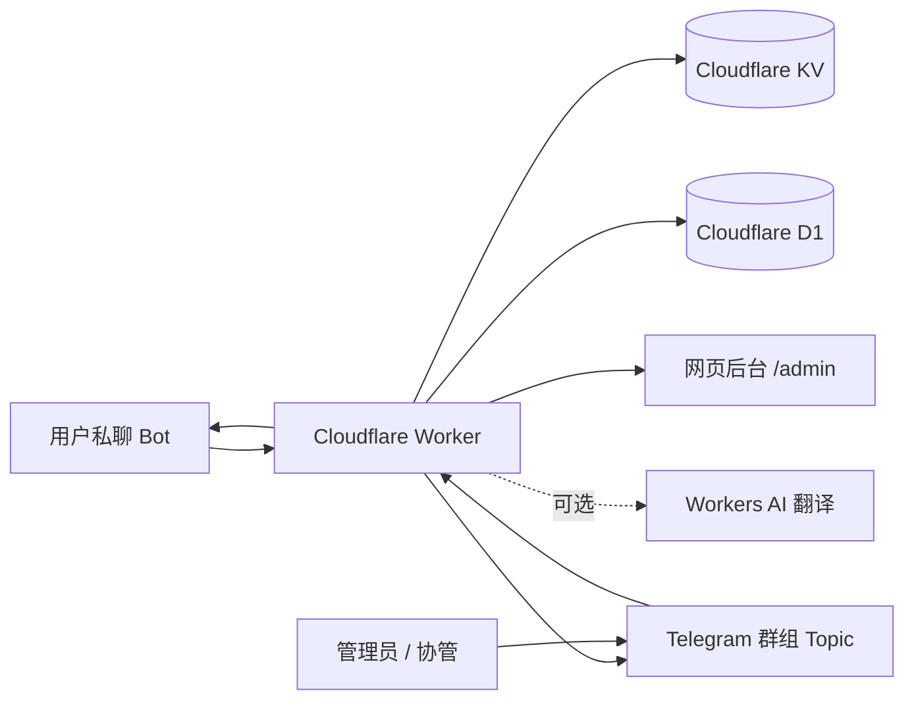

<div align="center">

# NooMiChat

**基于 Cloudflare Workers 的 Telegram 私聊中继 / 客服 / 协管机器人**

NooMiChat 是基于 RelayGo 开源项目二次开发的 Telegram 私聊中继系统。它可以把用户私聊转发到 Telegram 群组 Topic，支持协管权限、D1 数据库、验证系统、CRM 资料卡、黑名单隔离、聚合收件箱、网页后台和 AI 翻译。

[项目地址：lijboys/NooMiChat](https://github.com/lijboys/NooMiChat)

[](https://workers.cloudflare.com/)
[](https://core.telegram.org/bots)
[](https://developers.cloudflare.com/d1/)
[](https://developers.cloudflare.com/kv/)
[](https://developers.cloudflare.com/workers-ai/)
[](#)

</div>

---

## ✨ 功能亮点

- 🚀 **纯 Worker 部署**：单文件 `RelayGo.js`，无需服务器、无需 Docker。
- 🧭 **内置网页后台**：访问 `/admin` 即可查看状态、一键设置 Webhook、切换常用配置。
- 🧵 **Topic 中继**：每个用户一个 Telegram Topic，管理员在 Topic 内直接回复。
- 🛡️ **D1 + KV 双存储**：D1 保存业务数据，KV 保留缓存、兼容旧数据和临时状态。
- 👮 **协管权限**：`reply`、`panel`、`ban`、`config` 四类权限，`OWNER_ID` 默认全权限。
- 🔐 **验证系统**：支持 Turnstile、reCAPTCHA、本地问答、组合验证和失败封禁。
- 📴 **营业状态**：一键切换营业中 / 休息中，休息提示支持用户冷却。
- 🚫 **黑名单隔离**：封禁用户进入黑名单 Topic，支持重新验证 / 申诉流程。
- 🧾 **CRM 资料卡**：UID、姓名、用户名、语言、消息数、备注、标签、手机号归属地提示。
- 🔔 **聚合收件箱**：未读 Topic 中每个用户只保留一张通知卡，不刷屏。
- 📦 **导入导出**：只导出业务配置，不包含 Token、环境变量和绑定名。
- 🌐 **AI 翻译**：非中文用户消息可自动追加中文翻译，失败不影响中继。
- 🧩 **无群组兼容**：未绑定群组时，用户消息会转发给主人私聊，基础使用不断流。

## 📸 管理方式

| 入口 | 说明 |
| --- | --- |
| `/admin` 网页后台 | 浏览器管理基础配置、一键设置 Webhook 和 Bot 命令菜单 |
| Telegram `/menu` | 管理员私聊或群内打开内联面板 |
| Telegram `/bind` | 在开启 Topic 的群组里绑定中继群 |
| Telegram `/addadmin` | 添加协管 |
| Telegram `/export` / `/import` | 导出 / 导入业务配置 |

### 后台目录

网页版 `/admin` 和 Telegram `/menu` 使用同一套目录逻辑：

| 一级目录 | 主要内容 |
| --- | --- |
| **部署** | Worker 状态、Webhook、Bot 命令菜单、诊断信息 |
| **运营** | 营业状态、休息提示、AI 翻译、中继相关开关 |
| **安全** | 新用户验证、防骚扰、关键词拦截、联合封禁 |
| **内容** | 欢迎语、自动回复、底部品牌文案、欢迎按钮 |
| **用户** | 本地黑名单、本地申诉、联合申诉、协管权限 |
| **系统工具** | 语言、导入配置、导出配置 |

## 🧱 架构概览



## 🚀 网页版部署教程

### 1. 准备 Telegram Bot

1. 打开 Telegram，找 `@BotFather`。
2. 发送 `/newbot` 创建机器人。
3. 复制 Bot Token，格式类似：

```text
123456789:AAExampleTokenExampleToken
```

4. 找 `@userinfobot` 查询你自己的 Telegram 数字 ID，例如：

```text
123456789
```

这个数字就是 `OWNER_ID`，不是用户名、不是手机号、不是 Bot ID。

### 2. 创建 Cloudflare Worker

1. 打开 Cloudflare Dashboard。
2. 进入 `Workers & Pages`。
3. 点击 `Create application` → `Create Worker`。
4. 创建后进入 `Edit code`。
5. 删除默认代码，把 `RelayGo.js` 的内容完整粘贴进去。
6. 点击 `Deploy`。

### 3. 配置环境变量

进入 Worker：`Settings` → `Variables and Secrets`。

| 变量名 | 必填 | 建议类型 | 说明 |
| --- | --- | --- | --- |
| `BOT_TOKEN` | ✅ | Secret | BotFather 给你的机器人 Token |
| `OWNER_ID` | ✅ | Variable | 你的 Telegram 数字 ID |
| `ADMIN_KEY` | ✅ 推荐 | Secret | 网页后台登录密钥，强烈建议设置 |

> 如果没有设置 `ADMIN_KEY`，网页后台会临时使用 `OWNER_ID` 作为密钥；正式使用建议单独设置强密码。

### 4. 绑定 KV

进入 Worker：`Settings` → `Bindings` → 添加绑定。

| 类型 | 变量名 | 说明 |
| --- | --- | --- |
| KV Namespace | `KV` | 必须叫 `KV` |

KV 用于保存临时验证、冷却、兼容旧数据、Topic 映射缓存等状态。注意：这里必须添加 **KV Namespace 绑定**，不要在 Variables 里手动创建名为 `KV` 的普通变量或 Secret，否则会出现 `env.KV.get is not a function`。

### 5. 绑定 D1 数据库

进入 Cloudflare Dashboard → `D1 SQL Database` → 创建数据库。

然后回到 Worker：`Settings` → `Bindings` → 添加 D1 绑定。

| 类型 | 推荐变量名 | 兼容变量名 |
| --- | --- | --- |
| D1 database | `DB` | `D1`、`DATABASE`、`NOOMICHAT_DB`、`RELAYGO_DB` |

#### D1 需要手动初始化吗？

**不需要手动建表。**

Worker 收到请求时会自动执行 `CREATE TABLE IF NOT EXISTS`，自动创建：

- `config`
- `users`
- `topics`
- `admins`
- `verify_sessions`
- `blacklist`
- `inbox_cards`
- `profile_cards`
- `audit_logs`

只要 D1 绑定成功，首次访问或收到 Webhook 后会自动初始化。

> KV 仍然是必需绑定。D1 保存长期业务数据，KV 保存验证会话、冷却、旧版兼容和临时缓存；变量名必须是 `KV`。

### 6. 可选：绑定 Workers AI

如果你要使用 AI 翻译：

| 类型 | 变量名 |
| --- | --- |
| Workers AI | `AI` |

默认模型：

```text
@cf/meta/llama-3.2-1b-instruct
```

未绑定 `AI` 时，翻译功能会自动跳过，不影响中继。

## 🧭 一键设置 Webhook

部署完成后，打开：

```text
https://你的Worker域名/admin
```

在网页后台输入 `ADMIN_KEY`，然后点击：

```text
一键设置 Webhook + 菜单
```

登录成功后，后台密码会缓存在当前浏览器 30 天；刷新页面会先静默验证缓存，不再闪一下登录页。缓存过期、密码修改或验证失败时会自动回到登录页。

它会自动完成两件事：

1. 设置 Telegram Webhook 到当前 Worker：

```text
https://你的Worker域名/webhook
```

2. 设置 Telegram Bot 命令菜单：

```text
/start
/menu
/panel
/bind
/admins
/export
```

### 手动设置 Webhook

如果你想手动设置，也可以浏览器打开：

```text
https://api.telegram.org/bot你的BOT_TOKEN/setWebhook?url=https://你的Worker域名/webhook
```

检查 Webhook：

```text
https://api.telegram.org/bot你的BOT_TOKEN/getWebhookInfo
```

> `Webhook is already set` 只代表 Telegram 已保存这个 URL，不代表 Worker 代码已经正常处理消息。真正排查请看 `/admin` 的 `Run Diagnostics` 或 Worker 根路径返回的 `bindings` / `problems`。

## 🧵 绑定 Telegram 群组

完整客服中继模式需要一个 Telegram 群组。

### 群组要求

- 群组必须开启 `Topics / 话题`。
- 机器人必须是管理员。
- 建议开启权限：
  - 管理话题
  - 发送消息
  - 删除消息
  - 置顶消息

### 绑定方式

把机器人拉进群后，在群里发送：

```text
/bind
```

绑定成功后：

- 用户私聊 Bot，会自动创建个人 Topic。
- 管理员在该 Topic 里回复，消息会回到用户私聊。
- 黑名单、收件箱、资料卡也会使用固定 Topic 管理。

### 不创建群组能用吗？

可以基础使用，但不是完整模式。

未绑定群组时：

- 用户私聊会转发给主人私聊。
- 不会创建用户 Topic。
- CRM 资料卡、收件箱 Topic、黑名单 Topic 等群组能力不可用。

要获得完整客服后台体验，建议绑定开启 Topics 的群组。

## 🔑 权限系统

`OWNER_ID` 默认拥有全部权限，协管保存在 D1 的 `admins` 表。

| 权限 | 能力 |
| --- | --- |
| `reply` | 在话题里回复用户、设置备注和标签 |
| `panel` | 查看后台面板和协管列表 |
| `ban` | 封禁 / 解封用户 |
| `config` | 修改机器人配置、导入导出、绑定群组 |

### 添加协管

管理员私聊机器人发送：

```text
/addadmin 123456789 reply,panel
```

添加全权限协管：

```text
/addadmin 123456789 reply,panel,ban,config
```

删除协管：

```text
/deladmin 123456789
```

查看协管：

```text
/admins
```

## 🔐 验证系统

支持三类主模式：

- `off`
- `cloudflare_turnstile`
- `google_recaptcha`

本地问答模块：

- 数学题
- 算术按钮
- 发送贴纸 / 表情
- 表情选择
- 文字按钮
- 图片数字
- 自定义问答

组合模式：

- 只验证码
- 只问答
- 验证码 + 问答

常用配置可在 `/admin` 网页后台或 Telegram `/menu` 面板里调整。

验证前发送的消息不会保存、不会转发、不会创建 Topic；验证通过后，用户需要重新发送咨询内容。这样可以避免为了缓存未验证消息而带来的错发、重复转发或数据库脏数据问题。

自定义问答也可用命令设置：

```text
/verifyqa 问题 | 答案
```

## 📦 导入导出

导出业务配置：

```text
/export
```

导入 JSON 文本：

```text
/import
{
  "config": {
    "business_status": "open"
  }
}
```

不会导入 / 导出：

- `BOT_TOKEN`
- `OWNER_ID`
- `ADMIN_KEY`
- D1 绑定名
- KV 绑定名
- Worker 环境变量
- 任意包含 `token` 或 `secret` 的配置键

## 🧰 常用命令

| 命令 | 场景 | 说明 |
| --- | --- | --- |
| `/start` | 私聊 | 启动机器人 / 欢迎消息 |
| `/menu` | 私聊或群组 | 打开管理面板 |
| `/panel` | 私聊或群组 | 打开管理面板 |
| `/bind` | 群组 | 绑定当前群组 |
| `/admins` | 私聊 | 查看协管列表 |
| `/addadmin` | 私聊 | 添加协管 |
| `/deladmin` | 私聊 | 删除协管 |
| `/ban` | Topic | 封禁当前 Topic 用户 |
| `/unban` | Topic | 解封当前 Topic 用户 |
| `/note` | Topic | 设置备注 |
| `/tag` | Topic | 设置标签 |
| `/clear` | Topic | 删除备注 |
| `/export` | 私聊 | 导出业务配置 |
| `/import` | 私聊 | 导入业务配置 |

## ✅ 部署后检查清单

- [ ] Worker 根路径返回 `running`。
- [ ] Worker 根路径里的 `bindings.bot_token`、`bindings.owner_id`、`bindings.kv` 为 `true`。
- [ ] `/admin` 能打开网页后台。
- [ ] 网页后台输入 `ADMIN_KEY` 后能加载状态。
- [ ] `/admin` 点击 `Run Diagnostics`，`ready` 为 `true`。
- [ ] 点击“一键设置 Webhook + 菜单”成功。
- [ ] `getWebhookInfo` 里的 URL 指向当前 Worker `/webhook`。
- [ ] 私聊 Bot 发送 `/start` 有回复。
- [ ] 群组开启 Topics。
- [ ] Bot 是群管理员，并有管理话题权限。
- [ ] 群里发送 `/bind` 成功。
- [ ] D1 控制台能看到自动创建的表。

## 🧯 故障排查

### 网页后台显示 Unauthorized

检查：

- 是否设置了 `ADMIN_KEY`。
- 输入的密钥是否和 Cloudflare 环境变量一致。
- 如果没设置 `ADMIN_KEY`，临时输入 `OWNER_ID`。

### 私聊机器人没反应

检查：

- `BOT_TOKEN` 是否正确。
- Webhook 是否指向当前 Worker。
- Worker 是否已重新 Deploy。
- KV 是否绑定为 `KV`。
- `OWNER_ID` 是否是你自己的 Telegram 数字 ID，不是用户名、手机号或 Bot ID。

最快排查方式：

1. 打开 Worker 根路径，例如 `https://你的Worker域名/`。
2. 确认返回里的 `status` 是 `running`。
3. 如果 `status` 是 `not_ready`，按 `problems` 里的提示修正绑定或环境变量。
4. 打开 `/admin`，输入 `ADMIN_KEY`，点击 `Run Diagnostics`。
5. 查看 `webhook.last_error_message`，这里会显示 Telegram 最近投递失败原因。

常见原因：

| 现象 | 原因 | 处理 |
| --- | --- | --- |
| `bindings.kv=false` | 没绑定 KV 或变量名不是 `KV` | 绑定 KV Namespace，变量名必须填 `KV` |
| `kv_binding_invalid=true` | Worker 看到的 `KV` 没有 `get/put/delete` 方法 | 打开 Worker 根路径，复制 `kv_detail`；通常是绑定类型/服务环境/部署版本不对 |
| `bindings.bot_token=false` | 没设置 `BOT_TOKEN` | 在 Variables and Secrets 添加 Secret |
| `bindings.owner_id=false` | 没设置 `OWNER_ID` | 填你的 Telegram 数字 ID |
| `Webhook is already set` 但没回复 | 只说明 URL 已设置，不说明 Worker 正常 | 跑 `/admin` 诊断，看 `problems` 和 `last_error_message` |


### 后台登录或保存很慢

新版后台的 `/api/status` 只读取本地 D1/KV 配置，不再登录时请求 Telegram；只有点击 `运行诊断`、`设置 Webhook + 菜单` 时才会访问 Telegram API。

如果仍然很慢，优先检查：

- Cloudflare Worker 是否在重新部署最新代码。
- D1 是否绑定成功；首次自动建表可能会慢一次。
- `运行诊断` 慢通常是 Telegram API 网络延迟，不影响后台登录。

### 已经添加 KV Binding 仍提示不是 KV Namespace

请打开 Worker 根路径，例如 `https://你的Worker域名/`，查看并复制 `kv_detail`。

正常应接近：

```json
{
  "present": true,
  "valid": true,
  "methods": { "get": "function", "put": "function", "delete": "function" }
}
```

如果 `methods.get` 不是 `function`，说明当前部署环境拿到的 `KV` 仍不是 KV Namespace。常见原因：绑定加在了另一个 Worker、另一个环境，或者修改绑定后没有重新 Deploy。

### `/bind` 失败

检查：

- 群组是否开启 Topics。
- Bot 是否是管理员。
- Bot 是否有“管理话题”权限。
- 发送 `/bind` 的账号是否是 `OWNER_ID` 或有 `config` 权限。

### D1 没有表

D1 表是自动初始化的，但需要触发 Worker。

可以：

1. 打开 Worker 根路径。
2. 打开 `/admin`。
3. 私聊 Bot 发送 `/start`。
4. 再去 D1 控制台查看表。

### AI 翻译没有出现

检查：

- 是否绑定了 Workers AI，变量名为 `AI`。
- 网页后台或 `/menu` 是否开启 AI 翻译。
- 用户消息是否已经是中文；中文消息不会重复翻译。

## 🔒 安全建议

- `BOT_TOKEN` 和 `ADMIN_KEY` 必须使用 Cloudflare Secret。
- 不要把 `BOT_TOKEN` 写进代码或 README。
- `ADMIN_KEY` 不要使用简单数字，建议使用长随机字符串。
- 导入配置前先检查 JSON 内容，避免覆盖重要业务设置。
- 协管只给必要权限，不要默认给所有人 `config`。

## 🗂️ 数据说明

| 存储 | 用途 |
| --- | --- |
| D1 `config` | 业务配置 |
| D1 `users` | 用户资料、状态、统计 |
| D1 `topics` | Topic 与用户映射 |
| D1 `admins` | 协管权限 |
| D1 `verify_sessions` | 验证会话状态 |
| D1 `blacklist` | 黑名单记录 |
| D1 `inbox_cards` | 聚合收件箱卡片 |
| D1 `profile_cards` | 用户资料卡 |
| D1 `audit_logs` | 管理审计日志 |
| KV | 临时状态、缓存、兼容旧数据 |

## 🛣️ 推荐上线流程

1. 先部署 Worker、绑定 KV 和 D1。
2. 设置 `BOT_TOKEN`、`OWNER_ID`、`ADMIN_KEY`。
3. 打开 `/admin` 一键设置 Webhook。
4. 私聊 Bot 测试 `/start` 和 `/menu`。
5. 创建并绑定开启 Topics 的 Telegram 群组。
6. 测试用户私聊、Topic 回复、封禁、解封、导入导出。
7. 最后按需开启验证系统、AI 翻译和休息模式。

## 📄 文件结构

```text
.
├── RelayGo.js   # Worker 主程序
└── README.md    # 部署和使用文档
```

## 🙌 维护提示

这个项目是单文件 Worker，升级时建议：

- 先备份当前 `RelayGo.js`。
- 导出业务配置 JSON。
- 在测试 Worker 验证通过后再替换生产 Worker。
- 不要导出或提交真实 Token、Secret、环境变量。

---

<div align="center">

**NooMiChat — 基于 RelayGo 二次开发，用 Cloudflare Workers 搭建轻量、可控、免服务器的 Telegram 客服中继系统。**

</div>
